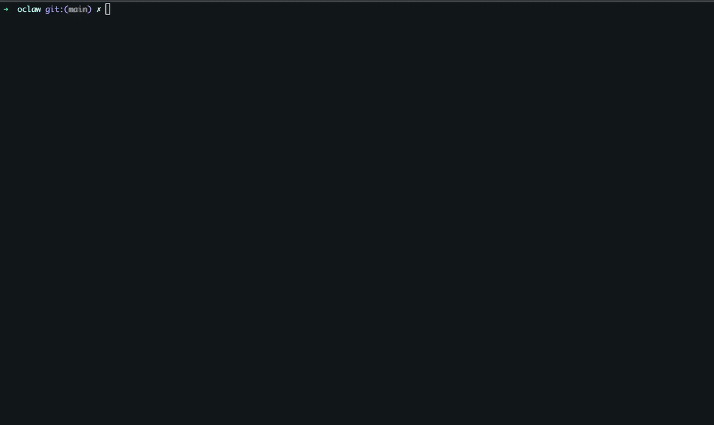

# oclaw

A terminal UI for [OpenClaw](https://github.com/openclaw/openclaw) — interactive agent chat with streaming, session persistence, and multi-agent switching.

Built because the built-in `openclaw tui` is broken. `oclaw` connects directly to the gateway WebSocket with Ed25519 device signing, giving you a fast, reliable, interactive chat experience that doesn't time out.



## Features

- **Interactive chat** — persistent sessions, no timeouts
- **Streaming responses** — real-time token-by-token display for supported models
- **Thinking model support** — hidden by default, toggle with `Ctrl+T`
- **Multi-agent switching** — switch between agents mid-conversation (`Ctrl+A`)
- **Session management** — browse and resume sessions (`Ctrl+S`), reset with `/new`
- **Memory persistence** — `/save` command tells agents to write context to `MEMORY.md`
- **Markdown rendering** — code blocks, lists, headings, bold/italic via Glamour
- **Clickable hyperlinks** — URLs rendered as OSC 8 terminal hyperlinks (iTerm2, Kitty, WezTerm)
- **Animated thinking indicator** — shimmer gradient with rotating status messages
- **Slash command autocomplete** — type `/` to see available commands
- **Auto-reconnect** — exponential backoff with Ed25519 re-authentication
- **Scrollable chat** — mouse wheel, PgUp/PgDn, Ctrl+Home/End
- **Zero config** — auto-discovers gateway from `~/.openclaw/openclaw.json`
- **Security hardened** — input sanitization, secure device key handling, no debug logging by default

## Install

### Homebrew

```bash
brew tap quantum-bytes/oclaw
brew install oclaw
```

### Go

```bash
go install github.com/quantum-bytes/oclaw@latest
```

Or download a binary from [Releases](https://github.com/quantum-bytes/oclaw/releases).

### Requirements

- Go 1.22+ (for building)
- OpenClaw gateway running (default: `ws://127.0.0.1:39421`)
- Device identity at `~/.openclaw/identity/device.json` (created by `openclaw` CLI)

## Usage

```bash
# Launch with auto-discovered config
oclaw

# Connect to specific gateway
oclaw --url ws://localhost:39421 --token mytoken

# Start with a specific agent
oclaw --agent quasar
```

### Debug mode

```bash
OCLAW_DEBUG=1 oclaw
# Debug log written to a temp file (shown in stderr on startup)
```

## Keybindings

| Key | Action |
|-----|--------|
| `Enter` | Send message |
| `Shift+Enter` | New line in input |
| `Ctrl+C` | Clear input / abort response / quit (double-tap) |
| `Ctrl+D` | Quit immediately |
| `Ctrl+A` | Switch agent |
| `Ctrl+S` | Browse sessions |
| `Ctrl+N` | New session (reset) |
| `Ctrl+T` | Toggle thinking text visibility |
| `Ctrl+/` | Help overlay |
| `Esc` | Close overlay |
| `PgUp / PgDn` | Scroll chat by page |
| `Ctrl+Home` | Scroll to top of chat |
| `Ctrl+End` | Scroll to bottom of chat |
| `Home / End` | Move cursor in input |
| `Option+Click` | Select text (iTerm2) |

## Slash Commands

Type `/` in the input to see autocomplete suggestions.

| Command | Action |
|---------|--------|
| `/agent <id>` | Switch to agent |
| `/session` | Browse sessions |
| `/new` | Reset current session |
| `/save` | Save conversation context to agent's MEMORY.md |
| `/think <level>` | Set thinking level (off/low/medium/high) |
| `/help` | Show keybindings and commands |
| `/quit` | Quit |

## Configuration

`oclaw` reads configuration from multiple sources (highest priority first):

1. CLI flags (`--url`, `--token`, `--agent`)
2. Environment variables (`OPENCLAW_GATEWAY_URL`, `OPENCLAW_GATEWAY_TOKEN`, `OPENCLAW_AGENT`)
3. `~/.openclaw/openclaw.json` (gateway URL, token, agent list)
4. Defaults (`ws://127.0.0.1:39421`, token `ollama`)

## Authentication

`oclaw` supports two authentication methods:

1. **Token auth** — sends the configured token (read-only access)
2. **Device signing** — loads Ed25519 key from `~/.openclaw/identity/device.json`, signs the connect payload using the v3 protocol format, granting full read/write access

Device signing is automatic if the identity file exists (created by the `openclaw` CLI on first run).

## Architecture

```
oclaw ──WebSocket──► OpenClaw Gateway ──► Model APIs (Gemini, GPT-5.2-Codex, Ollama)
  │                       │
  │ Ed25519 device auth   ▼
  │                 Session Store (JSONL)
  │                       │
  └── chat events ◄───────┘ (delta/final streaming)
```

`oclaw` talks directly to the gateway via the OpenClaw WebSocket RPC protocol:
- **Connect**: challenge-response with optional Ed25519 device signing
- **Chat**: `chat.send` to send messages, `chat` events for streaming responses
- **Agent lifecycle**: `agent` events track thinking/responding/tool-use status
- **Sessions**: `sessions.list`, `chat.history` for persistence

## Building

```bash
git clone https://github.com/quantum-bytes/oclaw
cd oclaw
make build
./oclaw
```

### Cross-platform releases

```bash
# Requires goreleaser
goreleaser release --snapshot --clean
```

Builds for macOS (arm64/amd64), Linux (arm64/amd64), and Windows (amd64).

## Security

- Untrusted model output is sanitized (ANSI/OSC escape sequences stripped) before terminal rendering
- URLs in OSC 8 hyperlinks are sanitized against control character injection
- Device private keys are checked for secure file permissions (warns if not 0600)
- Debug logging is opt-in only (`OCLAW_DEBUG=1`) with secure temp files (0600)
- No secrets are logged or cached beyond the gateway connection lifetime

## License

MIT
